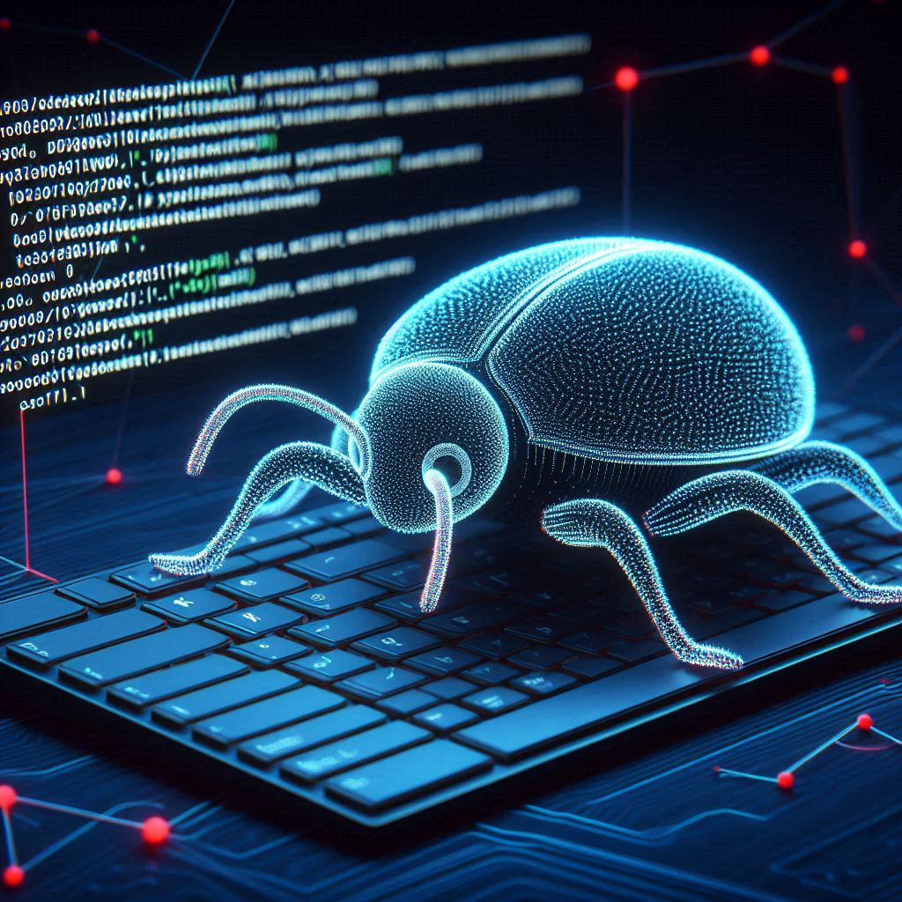

# termite
A reinforcement-learning agent to compete in C1Games' Terminal.

Feature goals:
- Initialized from high-level replays, optimized on self-play.
- Lightweight and fast on CPU.
- Competitive on the Terminal leaderboard.

</img>

## Setup
1. `git clone https://github.com/wz-ml/termite.git`

2. Create a new conda environment:

```bash
conda create -n termite python=3.11
conda activate termite
```

3. Navigate to the `termite` directory and install the `termite` package.

```bash
pip install -e .
```

>Note: Avoid using `python setup.py` as it doesn't install the package in editable mode, which is required if you don't want to reinstall the package every time you update its files.

## Development
Termite is currently under development. If you spot a bug or have an idea, please feel free to open an issue on Github.

Likewise, if you'd like to contribute, please make a fork of the directory and submit a pull request.

Todo:
- [x] Port the Terminal environment from java to Python.
- [ ] Verify that the ported Terminal matches the behavior of the real game.
    - [ ] Write test cases with Pytest.
- [ ] Build an OpenAI Gymnasium wrapper around the environment.
- [ ] Train a baseline model.